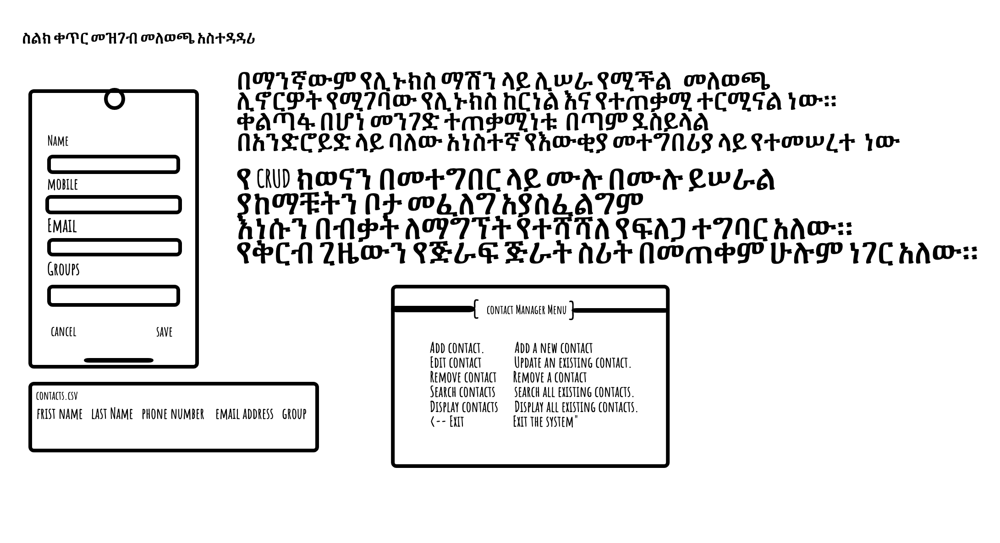

# ስልክ ቀጥር መዝገብ መለወጫ አስተዳዳሪ

_Read this in other languages:_
[_አማርኛ_](README.am-AM.md) [_English_](README.md) 

## 
በኮምፒዩተር ሲስተሞች ውስጥ ስልክ ቀጥር መዝገብ መለወጫ አስተዳዳሪ የተጠቃሚ ዳታ በማከማቸት ረገድ ትልቅ ሚና ይጫወታል።
ይህ የደንበኛ ዳታ ለማከማቸት እና በመሳሰሉት በአገልጋዮቻችን ውስጥ የበለጠ ሊተገበር ይችላል።
ቀልጣፋ በሆነ መንገድ ተጠቃሚው ማንኛውንም ፈጣን ለመጨመር እና ለመፈለግሞ ቀላል ያደርገዋል።




## ቅድመ-ሁኔታዎች

### Whiptail
- አፑ እንዲሰራ ዊፕታይል መጫን አለብን
 
### መጫን
#### ስለዚህ የሚከተሉትን የመጫኛ ትዕዛዞችን ያሂዱ

**በዴቢን ላይ የተመሠረተ ሊኑክስ ኮምፒተር**

```bash
sudo apt install whiptail
```
**አርች የተመሠረተ ሊኑክስ ኮምፒውተር**


```bash
sudo packman -Syu whiptail
```
**በቀይ ኮፍያ ላይ የተመሰረተ ሊኑክስ ኮምፒውተር**

```bash
sudo yum install whiptail
```

**ማክ ኦ.ኤስ**

```bash
brew install whiptail
```

## እንዴት ነው አሰራሩ
### መጀመሪያ መተግበሪያውን ከgithub በማውረድ 
```bash
git clone "https://github.com/ElrohiFilmon/Contact-Manager
```

### ዋናውን ስክሪፕት በመጠቀም ጀምር
```bash
./contact_manager.sh
```


## የኮድ መዋቅር

#### ፩ ስልክ ቀጥር መዝገብ መለወጫ
    - ለተጠቃሚዎች የሚመርጡበት ዝርዝር ምናሌ አለው።
    - መውጫ ምናሌ አለው።
### ፪. ጨምር ስልክ ቀጥር  መዝገብ
    - የመጀመሪያ ስም ፣ የአያት ስም ፣ የስልክ ቁጥር ፣ የኢሜል አድራሻ እና ቡድን ይጨምራል

### ፫. ለውጥ ስልክ ቀጥር መዝገብ
    - የስም ፍለጋ ዋጋ ይወስዳል
    - አዲሶቹን እሴቶች ይቀበላል።  
    - የተጠቃሚዎቹ ግቤት ትክክል መሆኑን ደግመው ያረጋግጣል
    - ስልክ ቀጥር መዝገብን በተፈለጉት ስም እና በተገመቱ እሴቶች እንደገና ይጽፋል 
### ፬. ሰርዝ ስልክ ቀጥር መዝገብ
    - የስም ፍለጋ ዋጋ ይወስዳል  
    - ተጠቃሚዎቹ መልሱ ትክክል ከሆነ ደግመው ያረጋግጡ
    - ከተፈለገ ስም ጋር እውቂያውን ይሰርዛል
### ፭. ፈልግ ስልክ ቀጥር መዝገብ
    - የስም ፍለጋ ዋጋ ይወስዳል
    - ካላገኘው የስህተት ዋጋ ይሰጣል
    - ከዚያ የተፈለገውን ዋጋ በውሂቡ ያወጣል።

### ፮. አሳይ ስልክ ቀጥር መዝገብ
    - በፋይላችን ውስጥ ያሉትን ሁሉንም አድራሻዎች ለማሳየት 10 በ 50 የመልእክት ሳጥን ይስሩ


## ገደቦች እና ሊሆኑ የሚችሉ ማሻሻያዎች
    ፩. የማሳያ ተግባራት ውስን ቦታ ብቻ ነው
    ፪. ምንም የፍለጋ ተግባር የለም

## የሚጠየቁ ጥያቄዎች
** ጥ *** ብዙ ስልክ ቀጥር እውቂያዎች በመልእክት ሳጥኑ ላይ እንዲታዩ መፈለግ እችላለሁን?
** ሀ ***: አይ፣ ይህ ተግባር በዚህ ስሪት ውስጥ የለም።

**ጥያቄ**: መዝገብ ሳንጽፈው እንዴት ማስገባት እንችላለን?
** አንድ ***: የዝማኔ አድራሻ ምናሌን በመጠቀም።

## የወደፊት ማሻሻያዎች
    - ለቀጣዩ እትም የማይታዩ ግን ግምት ውስጥ የማይገቡ አንዳንድ ባህሪያት አሉ።
    ፩. የተሻለ የማሳያ ሜኑ ቀረጻ በአዲስ ዊፕታይል ስሪቶች ሊፈታ ይችላል።

## References

- [Wikibooks](https://en.wikibooks.org/wiki/Bash_Shell_Scripting/Whiptail)
- [YouTube](https://www.youtube.com/watch?v=gtbX8J0jNkQ)
- [YouTube](https://www.youtube.com/watch?v=KsiPYMKSHU8)
- [GitHub](https://docs.github.com/en/get-started/writing-on-github)